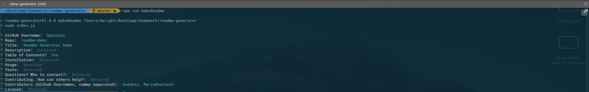
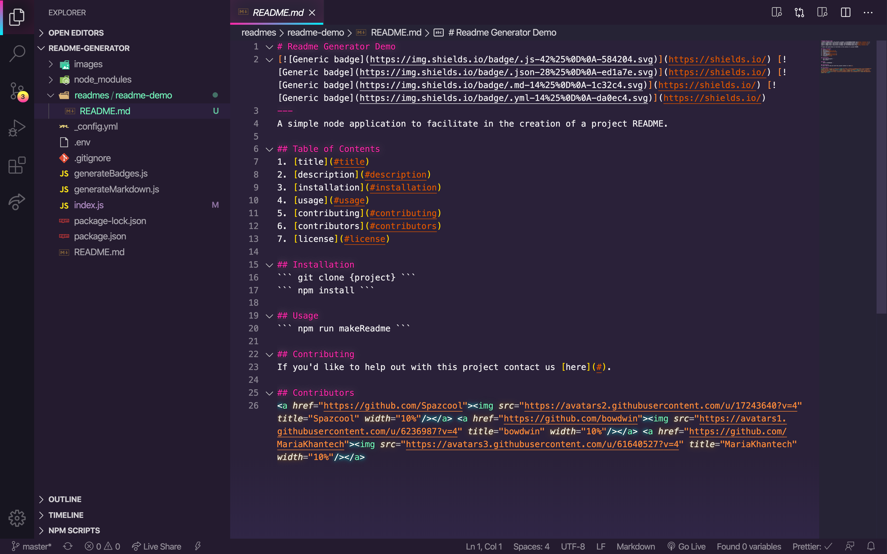
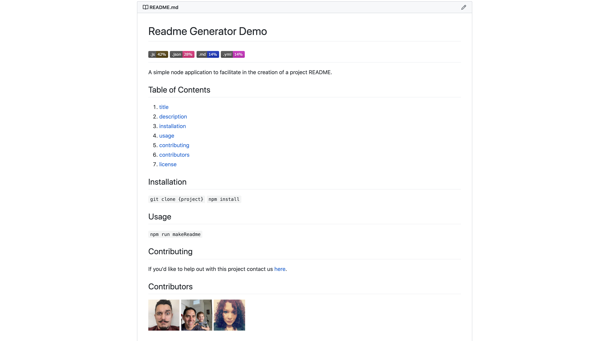

# README Generator
A simple CLI application that assists in the creation of a consistent README. Leveraging Inquirer, the user is asked a series of quesitons, their answers providing the text styled & saved to a new README file. This app runs in a Node environment.

<p align="center">
   
   
   
</p>

## Getting Started

Clone from the [Repo](https://github.com/Spazcool/readme-generator), install modules & run app: 

```
git clone https://github.com/Spazcool/readme-generator.git
```
```
npm install
```
```
npm run makeReadme
```

## Prerequisites

* Node.js

## Installing

As stated above, you'll need to install the dependencies after cloning the repo.

## Built With

* Node
* Inquirer
* axios
* fs
* GitHub API

## Authors

* **Douglas Wright** - [Spazcool](https://github.com/Spazcool)

## License

This project is licensed under the MIT License - see the [LICENSE.md](LICENSE.md) file for details.
